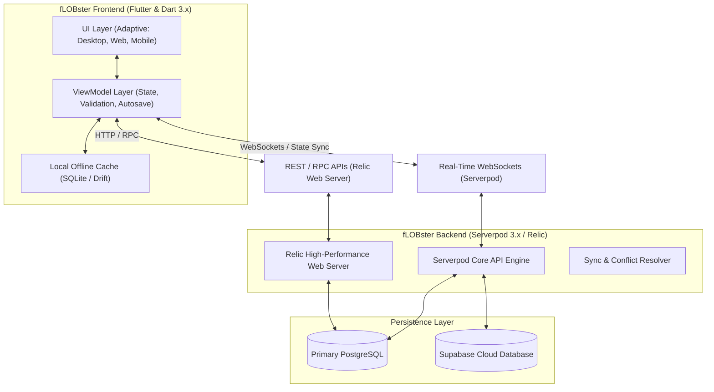
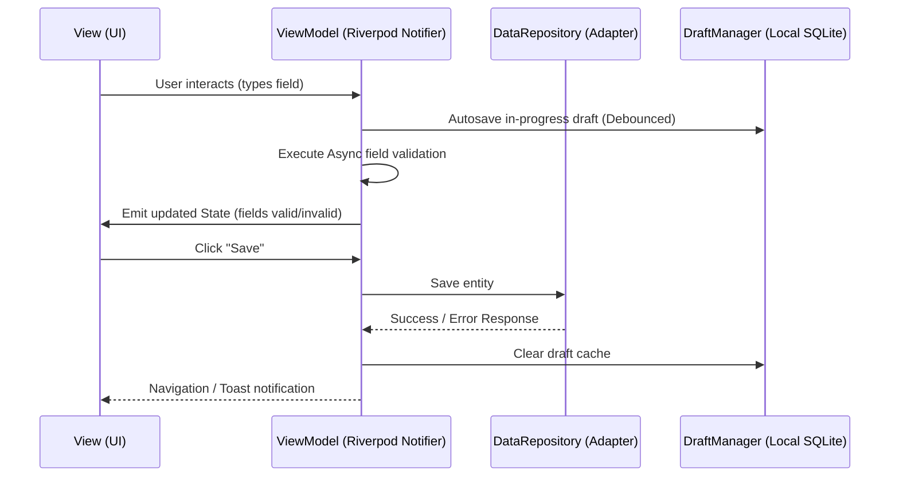
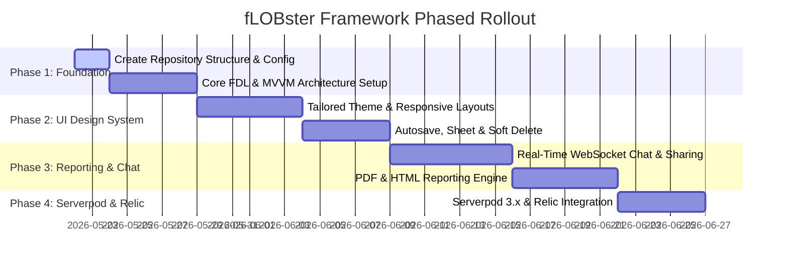

# fLOBster: High-Performance Line of Business (LOB) Flutter Framework
## Architecture Design Plan & Product Guidelines

> [!NOTE]
> fLOBster is a premium, developer-friendly, and AI-agent-optimized software framework designed to accelerate the development of complex Line of Business (LOB) applications. It bridges the intuitive, rapid UI patterns of **Claris FileMaker** with the modern, high-performance, and typed ecosystems of **Flutter (Dart 3.x)**, **Serverpod 3.x**, and the **Relic Web Server**.

---

## 1. System Architecture & Topology

fLOBster is architected to support **Multi-Platform UI clients** (Desktop, Web, iOS, Android) communicating with a unified backend and multiple data sources.



### Persistence Layer Strategies
fLOBster provides an abstract data persistence layer (`fLOBster Data Layer`) supporting four selectable persistence providers:
1. **Direct PostgreSQL Connection**: Optimized for desktop applications deployed inside corporate intranets (utilizing the Dart `postgres` client).
2. **Local SQLite (Mobile/Offline)**: Embedded storage via SQLite (using the `drift` reactive persistence library) with background synchronizers.
3. **API Web Services**: Client-to-server RPC via Serverpod clients or custom JSON REST/GraphQL connections.
4. **Supabase Integration**: Direct cloud persistence using the official `supabase_flutter` client, perfect for rapid SaaS setups.

---

## 2. The Front-End MVVM Paradigm

To make the codebase highly readable, maintainable, and **AI-agent-friendly**, fLOBster implements a strict MVVM pattern powered by code-generated state managers (e.g., **Riverpod** with Dart 3.x annotation builders).



### The AI-Friendly Blueprint
By using strict separation of concerns, AI agents can read and write code with minimal context:
- **Views**: Purely declarative UI. No business logic, no direct db queries. They bind strictly to ViewModels.
- **ViewModels**: State objects containing input validation, field bindings, async commands, and network states.
- **Models**: Serialized Dart 3 classes using `freezed` or Serverpod's `.yaml` generators, enabling automatic JSON mapping and deep equality checks.

---

## 3. UI Design System & Aesthetics

Line of Business software must not look like boring legacy enterprise apps. fLOBster features a modern, cohesive, and dynamic design system.

### Visual Palette & Typography
- **Core Aesthetic**: Rich Dark Mode by default, Glassmorphism panels (backdrop filters) for high-end styling, and curated HSL-tailored colors.
- **Palette**:
  - **Background**: Deep Indigo Gray (`#0F111A`)
  - **Surface**: Translucent Glass Slate (`rgba(30, 34, 51, 0.7)`) with custom-designed subtle borders
  - **Primary**: Electric Cyan (`#00F2FE`) to Royal Blue (`#4FACFE`) Gradients
  - **Success / Safety**: Mint Emerald (`#00F5A0`)
  - **Warning / Error**: Bright Rosewood (`#FF4B6E`)
- **Typography**: Utilizing Google Fonts like `Outfit` or `Inter` for modern readability.

### Layout & Page Workflows
1. **The Navigation Shell**: Sidebar navigation that automatically collapses into a sleek bottom bar on mobile screens.
2. **List View Pattern**:
   - Dynamic datagrid with column-sorting, full-text fuzzy search, and lazy loading.
   - **Quick Sheet Overlay**: Clicking a row slides a read-only Sheet from the right side of the viewport, presenting metadata without breaking the user's route context.
3. **Form View Pattern**:
   - Form editor supporting step-by-step Wizards, multi-column dynamic fields, and inline suggestions.
   - **Autosave & Recovery**: Drafts are continuously debounced and saved locally to SQLite. If the browser tabs crash, or the desktop app closes, a clean bar at the top notifies the user: *"You have an unsaved draft from yesterday. Click to restore."*
   - **Editing Modes**: Support for both full-page editing and inline double-click table editing.
   - **Soft Delete & Recovery**: Deletes do not purge database rows immediately. They mark `deleted_at = DateTime.now()`. A micro-animated Snackbar appears offering an **[Undo]** button. An explicit Recycle Bin view is available for full-system restoration.

---

## 4. Real-Time Collaboration & Chat Engine

fLOBster implements a real-time messaging subsystem powered by Serverpod's WebSockets.

### Shareable Database Record Cards
The key feature of the chat is **Record Sharing**:
- Inside the chat editor, users can click `[Link Record]` or type `@` to reference a database entity (e.g., `@Invoice #INV-2026-001`).
- This parses into a deep-link schema: `flobster://record/{model}/{id}`.
- When rendered in the chat bubble, it is displayed as a **Rich Interactive Card**:

```
+------------------------------------------------------+
|  [Icon] Invoice #INV-2026-001             [Active]   |
|  Customer: Acme Corp                                 |
|  Total: $12,450.00                                   |
|  --------------------------------------------------  |
|  [ View Details ]                [ Duplicate Form ]  |
+------------------------------------------------------+
```

- Clicking **[View Details]** triggers a local event that slides out the right-aligned Sheet presenting the live read-only record.

---

## 5. Reporting Engine (PDF & HTML)

fLOBster provides a dedicated package `flobster_reporting` containing design interfaces and rendering generators.

```
+-----------------------------------------------------------+
|                    flobster_reporting                     |
+-----------------------------------------------------------+
                             |
         +-------------------+-------------------+
         |                                       |
         v                                       v
+------------------+                   +--------------------+
|  HTML Generator  |                   |   PDF Generator    |
|  - Mustache/Liquid                   |  - Native PDF lib  |
|  - Relic Server  |                   |  - Stream-based    |
|  - CSS Styling   |                   |  - Page-breaking   |
+------------------+                   +--------------------+
```

- **HTML Reports**: Render templates on the Relic Web Server (using Mustache or Liquid compilers) and display them in-app using custom Dart webview hooks, or export directly to clean reports.
- **PDF Reports**: Utilizes the native Dart `pdf` rendering package to generate vector-based, multi-page documents (invoices, ledgers, summary statements) entirely on-device, or offloaded to the server for mass exports.

---

## 6. Real-Time Dashboards & Aggregations

- **Metric Engine**: Stream-based metric listeners that recalculate counters and sums instantly.
- **Data Visualizations**: Built-in charting components using customizable wrappers around `fl_chart` with gradient glow effects.

---

## 7. Developer & AI Agent Friendly Specs (Spec-Driven Dev)

To guarantee that new developers and AI agents can build modules with extreme accuracy:
- **Spec-Driven Architecture**: Every new module or form in fLOBster starts with a `.yaml` definition. The code generator parses this file to bootstrap:
  1. The Database migration schemas.
  2. The ViewModel code.
  3. Simple View layouts.
- **Automated Tests**: Unit tests verify serialization, validation logic, and repository methods. Integration/UI tests verify form recovery mechanics and right-sheet animations.

---

## 8. Proposed Phased Implementation Roadmap



### Next Steps for Implementation
1. Initialize the project repository with modular Flutter package layout (`packages/flobster_core`, `packages/flobster_ui`, `packages/flobster_reporting`).
2. Create unit test skeletons to bootstrap our Spec-Driven Development approach.
3. Configure GitHub actions for automatic CI testing on the newly created `feature/framework-design-plan` branch.
